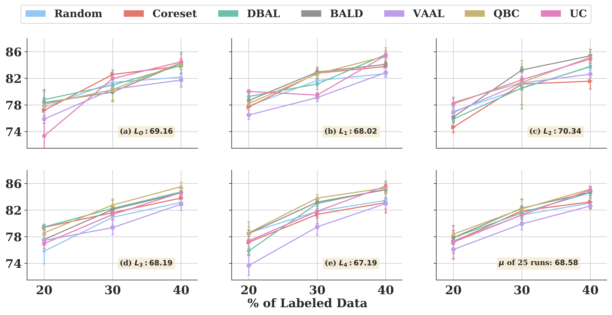
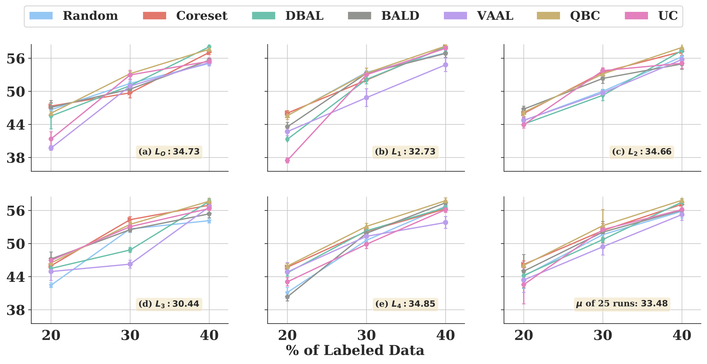
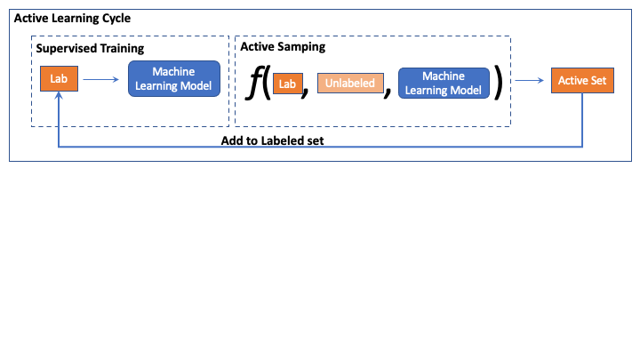
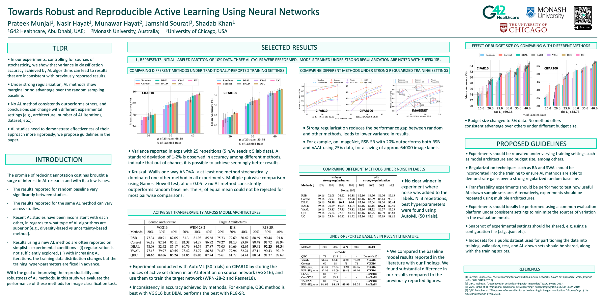

# TorchAL codebase

Source code for our CVPR 2022 Paper: [Towards Robust and Reproducible Active Learning Using Neural Networks](https://arxiv.org/abs/2002.09564)

[](https://paperswithcode.com/sota/active-learning-on-cifar10-10000?p=towards-robust-and-reproducible-active)

<figure>

<!--  -->
<h2 style="text-align: center;">CIFAR10 Results</h2>


<h2 style="text-align: center;">CIFAR100 Results</h2>


<figcaption align = "center">Figure 1. Comparisons of AL methods on CIFAR10 (top) and CIFAR100 (bottom) for different initial labeled sets L0, L1, · · · , L4. The mean accuracy for the base model (at 10% labeled data) is noted at the bottom of each subplot. The model is trained 5 times for different random initialization seeds where for the first seed we use AutoML to tune hyper-parameters and re-use these hyper-parameters for the other 4 seeds.</figcaption>
</figure>


## Abstract

Active learning (AL) is a promising ML paradigm that has the potential to parse through large unlabeled data 
and help reduce annotation cost in domains where labeling data can be prohibitive. Recently proposed neural 
network based AL methods use different heuristics to accomplish this goal. In this study, we demonstrate that 
under identical experimental settings, different types of AL algorithms (uncertainty based, diversity based, 
and committee based) produce an inconsistent gain over random sampling baseline. Through a variety of 
experiments, controlling for sources of stochasticity, we show that variance in performance metrics achieved 
by AL algorithms can lead to results that are not consistent with the previously reported results. We also 
found that under strong regularization, AL methods show marginal or no advantage over the random sampling 
baseline under a variety of experimental conditions. Finally, we conclude with a set of recommendations on 
how to assess the results using a new AL algorithm to ensure results are reproducible and robust under 
changes in experimental conditions. We share our codes to facilitate AL evaluations. We believe our findings 
and recommendations will help advance reproducible research in AL using neural networks.

## What is TorchAL?

TL;DR: An Active Learning framework built on top of [pycls](https://github.com/facebookresearch/pycls).

TorchAL is an evaluation toolkit with a motive to advance the **reproducible** research in deep active learning. We currently implement state-of-the-art 
active learning (AL) algorithms. Our tookit extends the widely used [pycls](https://github.com/facebookresearch/pycls) codebase under AL settings.

## Features of TorchAL

* We report strong random baselines across widely used architectures and datasets.
* Our baselines are well-trained using AutoML which helps in reducing the bias introduced by choosing sub-optimal hyper-parameters.
* As we dream of reproducible results in AL, we release the training, validation index sets so that newer AL methods in future can use exact labeled set for training as we used to report our strong baselines.
* For familiarity with the codebase, we recommend interested users to go through the [notebooks](https://github.com/PrateekMunjal/TorchAL/tree/master/notebooks). 

## AutoML in Active Learning

* During AL iterations we observed that labeled set changes and therefore does the class distribution too. 

* Most prior works in AL fix the hyper-parameters at the start of AL cycle. We note that this imposes a very strong assumption i.e <i>the hyper-parameters tuned for initial labeled partion **will remain optimal** for all future AL iterations.</i>

* Thus in contrast to contemporary AL methods which fix the training hyper-parameters at the start of AL, we 
tune the training hyper-parameters using AutoML. 

* To facilitate this we make use of [optuna](https://optuna.org/)
to perform random search over 50 trials for each AL cycle.

<!-- -->


## Poster presented at CVPR 22


## Requirements
* For creating a conda environment, kindly refer to [conda_env.yaml](conda_env.yml)
* For installing dependencies via pip, kindly refer to [requirements.txt](requirements.txt)

NOTE: In either case we have to download the dataset indexes and follow tools/train_al.py:
Dataset index sets
```shell
wget https://github.com/PrateekMunjal/torchal/blob/master/dataset_indexes.zip

```

## Installation

### From source

```
git clone https://github.com/PrateekMunjal/TorchAL
cd TorchAL
python setup.py install
```

### From pip
```
pip install torchal
```

## Dataset indexes and Pretrained models

* Dataset and active set indexes: [Click here to download](https://github.com/PrateekMunjal/TorchAL/blob/master/dataset_indexes.zip)
* Pretrained CIFAR models trained on 10% data: [Click here to download](https://drive.google.com/drive/folders/102nZ5pCofBDncKDFQc9tnyvQ8__IcIOi)

For interested readers we recommend to checkout notebook ensuring reproducible active sets. [Link to Notebook](https://github.com/PrateekMunjal/TorchAL/blob/master/notebooks/Active_Sampling.ipynb)

## AL algorithms implemented

* Uncertainty
* Coreset
* BALD
* DBAL
* VAAL
* QBC
* Random Baseline

## Experimental Settings

NOTE: Below 5% meains 5 percent of the full training dataset. For example, for CIFAR10 - we have 50k datapoints as their official training split so with 5% we have 2500 datapoints in our initial labeled set.

* Different budget sizes: 5%, 10% 
* Different validation set sizes: 2%, 5%, 10%
* Effect of regularization techniques
* We share [notebooks](https://github.com/PrateekMunjal/TorchAL/tree/master/notebooks) demonstrating such different experimental settings. 
* For interested readers we recommend to follow the summary of experiments presented [here](https://github.com/PrateekMunjal/TorchAL/tree/master/experiment_settings).

## Examples

### Run the random baseline without strong regularization

<details>
  <summary>Expand to see the full script</summary>

```
pythonExec=$1

cd /raid/shadab/prateek/newcode

# script params
port=5035
sampling_fn=uncertainty
lSet_partition=1
base_seed=1
num_GPU=2
al_iterations=4 #7 #4
num_aml_trials=3 #50
budget_size=5000 #2500

dataset=CIFAR10
init_partition=10
step_partition=10
clf_epochs=5 #150
num_classes=10

log_iter=40

#Data arguments
train_dir=/raid/shadab/prateek/newcode/data/$dataset/train-$dataset/
test_dir=/raid/shadab/prateek/newcode/data/$dataset/test-$dataset/
lSetPath=/raid/shadab/prateek/newcode/data/$dataset/partition_$lSet_partition/lSet_$dataset.npy
uSetPath=/raid/shadab/prateek/newcode/data/$dataset/partition_$lSet_partition/uSet_$dataset.npy
valSetPath=/raid/shadab/prateek/newcode/data/$dataset/partition_$lSet_partition/valSet_$dataset.npy

#for lSet 1
out_dir=/raid/shadab/prateek/newcode/results 

# for other lSet Exps
# out_dir=/raid/shadab/prateek/newcode/results_lSetPartitions

#model_types: (i) wide_resnet_50 (ii) wide_resnet_28_10 (iii) wide_resnet_28_2

model_style=vgg_style
model_type=vgg #resnet_shake_shake
model_depth=16 #26

export CUDA_VISIBLE_DEVICES=0,1

$pythonExec tools/main_aml.py --n_GPU $num_GPU \
--port $port --sampling_fn $sampling_fn --lSet_partition $lSet_partition \
--seed_id $base_seed \
--init_partition $init_partition --step_partition $step_partition \
--dataset $dataset --budget_size $budget_size \
--out_dir $out_dir \
--num_aml_trials $num_aml_trials --num_classes $num_classes \
--al_max_iter $al_iterations \
--model_type $model_type --model_depth $model_depth \
--clf_epochs $clf_epochs \
--eval_period 1 --checkpoint_period 1 \
--lSetPath $lSetPath --uSetPath $uSetPath --valSetPath $valSetPath \
--train_dir $train_dir --test_dir $test_dir \
--dropout_iterations 25 \
--cfg configs/$dataset/$model_style/$model_type/R-18_4gpu_unreg.yaml \
--vaal_z_dim 32 --vaal_vae_bs 64 --vaal_epochs 15 \
--vaal_vae_lr 5e-4 --vaal_disc_lr 5e-4 --vaal_beta 1.0 --vaal_adv_param 1.0 \

```
</details>

<br>
Usage: Assume above script is named as **run.sh**, then we can simply run it 

```
sh run_exp.sh
```

<br>

### Run the random baseline with strong regularization

In the above script we only need to add few more switches to add strong-regularization.

```
swa_lr=5e-4
swa_freq=50
swa_epochs=5 #50

...
--rand_aug --swa_mode --swa_freq $swa_freq --swa_lr $swa_lr \
--swa_epochs $swa_epochs --swa_iter 0 \

```

## Citing TorchAL

If you use TorchAL, please consider citing:

    @inproceedings{Munjal2022TorchAL,
        title={Towards Robust and Reproducible Active Learning Using Neural Networks}, 
        author={Prateek Munjal and Nasir Hayat and Munawar Hayat and Jamshid Sourati 
                and Shadab Khan},
        booktitle={CVPR},
        year={2022}
    }

## Acknowledgement 

This repository is built using the following repositories. Thanks for their wonderful works. 

* [pycls](https://github.com/facebookresearch/pycls)
* [Coreset](https://github.com/ozansener/active_learning_coreset)
* [VAAL](https://github.com/sinhasam/vaal)
* [CoreGCN](https://github.com/razvancaramalau/Sequential-GCN-for-Active-Learning)

## Contact

If you have any question about this project, please feel free to contact prateekmunjal31@gmail.com or skhan.shadab@gmail.com.
