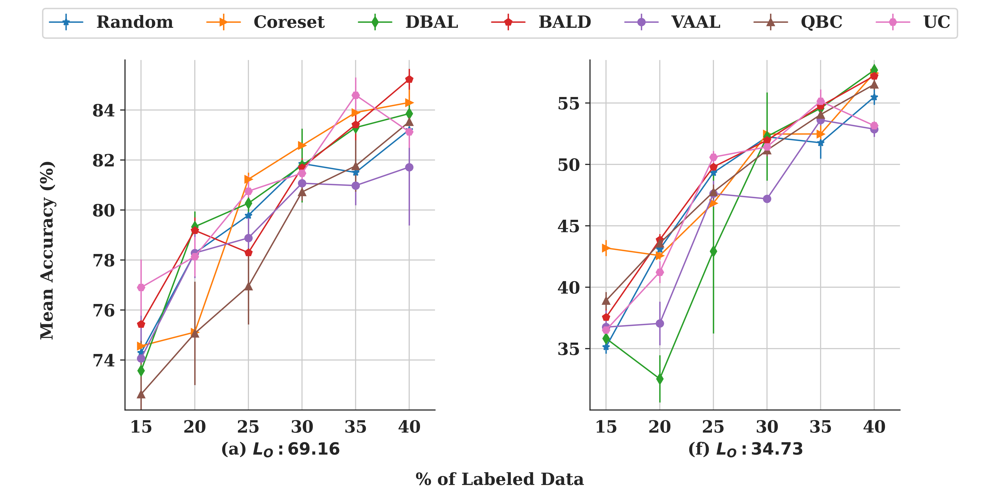
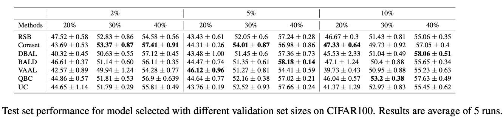
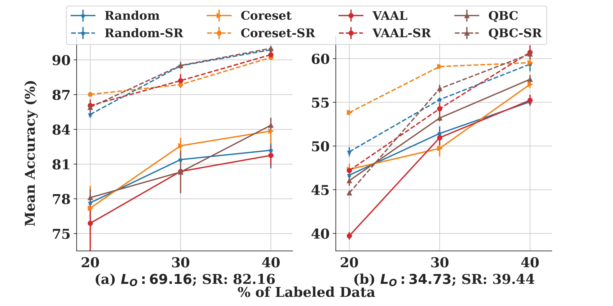
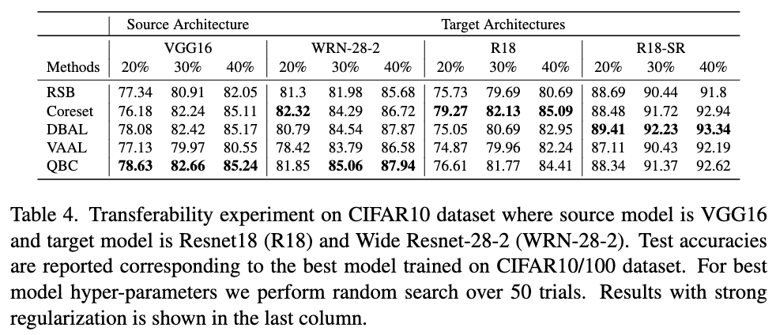

# Differing Experimental Conditions

NOTE: We noticed that sometimes github either takes too long to render the output or does not output at all in python notebooks. 
So we recommend to interested readers to checkout notebooks at [nbviewer](https://nbviewer.org/).

In this notebook we demonstrate how we can use our AL toolkit to benchmark AL performance under different AL settings:

## 1. Effects of annotation batch size

Results using 5% of training data is annotated at each iteration of AL on (a) CIFAR10 and (b) CIFAR100. Mean accuracy for the base model (at 10% labeled data) is noted at the bottom of each subplot

Command to run
<pre>
budget_size=2500 # For 5% budget size
budget_size=5000 # For 10% budget size
<code>
!python3 $HOME_DIRECTORY/tools/main_aml.py --n_GPU $num_GPU \
--port $port --sampling_fn $sampling_fn --lSet_partition $lSet_partition \
--seed_id $base_seed \
--init_partition $init_partition --step_partition $step_partition \
--dataset $dataset <b style="color:blue">--budget_size $budget_size </b> \
--out_dir $out_dir \
--num_aml_trials $num_aml_trials --num_classes $num_classes \
--al_max_iter $al_iterations \
--model_type $model_type --model_depth $model_depth \
--clf_epochs $clf_epochs \
--eval_period 1 --checkpoint_period 1 \
--lSetPath $lSetPath --uSetPath $uSetPath --valSetPath $valSetPath \
--train_dir $train_dir --test_dir $test_dir \
--dropout_iterations 25 \
--cfg configs/$dataset/$model_style/$model_type/R-18_4gpu_unreg.yaml \
--vaal_z_dim 32 --vaal_vae_bs 64 --vaal_epochs 2 \
--vaal_vae_lr 5e-4 --vaal_disc_lr 5e-4 --vaal_beta 1.0 --vaal_adv_param 1.0 
</code>

</pre>

For interested readers we also share a sample notebook for this experiment. Please note that in the shared notebook we only run model training for few epochs, 
hence to reproduce results we recommend to train as per the settings mentioned in the main paper. 

Notebook: [Link](../notebooks/budgetsize_exp.ipynb)

Nbviewer Notebook: [Link](https://nbviewer.org/github/PrateekMunjal/wowal/blob/master/notebooks/budgetsize_exp.ipynb)

## 2. Varying validation set size

Command to run
<pre>
# We only need to provide the correct paths in this case.

<b style="color:blue">lSetPath</b>=f"{HOME_DIRECTORY}/data/{dataset}/val-set-1k/partition_{lSet_partition}/lSet_{dataset}.npy"
<b style="color:blue">uSetPath</b>=f"{HOME_DIRECTORY}/data/{dataset}/val-set-1k/partition_{lSet_partition}/uSet_{dataset}.npy"
<b style="color:blue">valSetPath</b>=f"{HOME_DIRECTORY}/data/{dataset}/val-set-1k/partition_{lSet_partition}/valSet_{dataset}.npy" 
<code>
!python3 $HOME_DIRECTORY/tools/main_aml.py --n_GPU $num_GPU \
--port $port --sampling_fn $sampling_fn --lSet_partition $lSet_partition \
--seed_id $base_seed \
--init_partition $init_partition --step_partition $step_partition \
--dataset $dataset --budget_size $budget_size \
--out_dir $out_dir \
--num_aml_trials $num_aml_trials --num_classes $num_classes \
--al_max_iter $al_iterations \
--model_type $model_type --model_depth $model_depth \
--clf_epochs $clf_epochs \
--eval_period 1 --checkpoint_period 1 \
<b style="color:blue">--lSetPath $lSetPath \
--uSetPath $uSetPath \
--valSetPath $valSetPath \</b>
--train_dir $train_dir --test_dir $test_dir \
--dropout_iterations 25 \
--cfg configs/$dataset/$model_style/$model_type/R-18_4gpu_unreg.yaml \
--vaal_z_dim 32 --vaal_vae_bs 64 --vaal_epochs 2 \
--vaal_vae_lr 5e-4 --vaal_disc_lr 5e-4 --vaal_beta 1.0 --vaal_adv_param 1.0 
</code>

</pre>

For interested readers we also share a sample notebook for this experiment. Please note that in the shared notebook we only run model training for few epochs, 
hence to reproduce results we recommend to train as per the settings mentioned in the main paper. 

Notebook: [Link](../notebooks/valSetexp_cifar10.ipynb)

Nbviewer Notebook: [Link](https://nbviewer.org/github/PrateekMunjal/wowal/blob/master/notebooks/valSetexp_cifar10.ipynb)

## 3. Add strong-regularization in training pipeline

### Imagenet Results

Effect of strong regularization (RA, SWA) (shown in dashed lines) on Imagenet where annotation budget is 5% of training data. Reported results are averaged over 3 runs

### CIFAR10/100 results

Effect of strong regularization (RA, SWA) on the test accuracy of CIFAR10(a) and CIFAR100(b) dataset. The mean accuracy for the base model (at 10% labeled data) is noted at the bottom of each subplot.

Command to run
<pre>
# We only need to add few switches to apply strong regularization

#Add RandAug(RA) noise in data.
#N and M hyper-parameters of RA are chosen using AutoML.
--rand_aug

#Adds params required for SWA.
--swa_mode --swa_freq $swa_freq --swa_lr $swa_lr --swa_epochs $swa_epochs --swa_iter 0
<code>
!python3 $HOME_DIRECTORY/tools/main_aml.py --n_GPU $num_GPU \
--port $port --sampling_fn $sampling_fn --lSet_partition $lSet_partition \
--seed_id $base_seed \
--init_partition $init_partition --step_partition $step_partition \
--dataset $dataset --budget_size $budget_size \
--out_dir $out_dir \
--num_aml_trials $num_aml_trials --num_classes $num_classes \
--al_max_iter $al_iterations \
--model_type $model_type --model_depth $model_depth \
--clf_epochs $clf_epochs \
--eval_period 1 --checkpoint_period 1 \
--lSetPath $lSetPath \
--uSetPath $uSetPath \
--valSetPath $valSetPath \
--train_dir $train_dir --test_dir $test_dir \
--dropout_iterations 25 \
--cfg configs/$dataset/$model_style/$model_type/R-18_4gpu_unreg.yaml \
--vaal_z_dim 32 --vaal_vae_bs 64 --vaal_epochs 2 \
--vaal_vae_lr 5e-4 --vaal_disc_lr 5e-4 --vaal_beta 1.0 --vaal_adv_param 1.0 
<b style="color:blue">--rand_aug --swa_mode --swa_freq $swa_freq --swa_lr $swa_lr \
--swa_epochs $swa_epochs --swa_iter 0 \ </b>
</code>

</pre>

## 4. Transfer learning experiment

This is an interesting experiment where we examine the transferability of the active sets sampled using the 
source network (VGG16), and use them to train the target network (ResNet18 and WRN-28-2). 

Results on CIFAR 10 dataset

Assuming VGG16 as source network and Resnet18 as target network.

Command to run 
<pre>
# We only need to add few switches to apply transfer experiment with few additional steps
# the additional steps are well explained in the sample notebook below.

--isTransferExp --transfer_model_type resnet_2 \
--transfer_model_style resnet_style --transfer_model_depth 18 --transfer_dir_specific vanilla \

<code>
!python3 $HOME_DIRECTORY/tools/main_aml.py --n_GPU $num_GPU \
--port $port --sampling_fn $sampling_fn --lSet_partition $lSet_partition \
--seed_id $base_seed \
--init_partition $init_partition --step_partition $step_partition \
--dataset $dataset --budget_size $budget_size \
--out_dir $out_dir \
--num_aml_trials $num_aml_trials --num_classes $num_classes \
--al_max_iter $al_iterations \
--model_type $model_type --model_depth $model_depth \
--clf_epochs $clf_epochs \
--eval_period 1 --checkpoint_period 1 \
--lSetPath $lSetPath --uSetPath $uSetPath --valSetPath $valSetPath \
--train_dir $train_dir --test_dir $test_dir \
--dropout_iterations 25 \
--cfg configs/$dataset/$model_style/$model_type/R-18_4gpu_unreg.yaml \
--vaal_z_dim 32 --vaal_vae_bs 64 --vaal_epochs 2 \
--vaal_vae_lr 5e-4 --vaal_disc_lr 5e-4 --vaal_beta 1.0 --vaal_adv_param 1.0 \
<b style="color:blue">--isTransferExp --transfer_model_type resnet_2 \
--transfer_model_style resnet_style --transfer_model_depth 18 --transfer_dir_specific vanilla \ </b>
</code>

</pre>

For interested readers we also share a sample notebook for this experiment. Please note that in the shared notebook we only run model training for few epochs, 
hence to reproduce results we recommend to train as per the settings mentioned in the main paper. 

Notebook: [Link](https://github.com/PrateekMunjal/TorchAL/blob/master/notebooks/transfer_active_sets.ipynb)

Nbviewer Notebook: [Link](https://nbviewer.org/github/PrateekMunjal/TorchAL/blob/master/notebooks/transfer_active_sets.ipynb)
