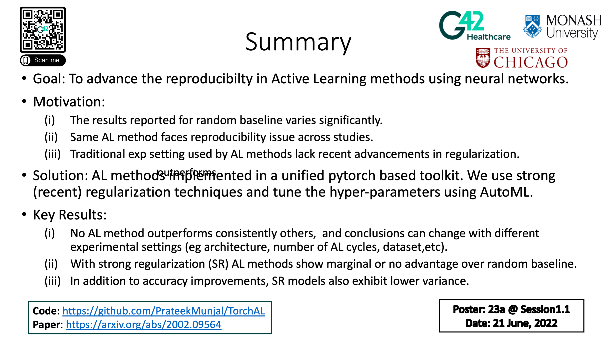

<!--s-->
#### Towards Robust and Reproducible Active Learning using Neural Networks

<!--s-->
#### Towards Robust and Reproducible Active Learning using Neural Networks

<!--s-->
#### Towards Robust and Reproducible Active Learning using Neural Networks

<!--s-->
#### Towards Robust and Reproducible Active Learning using Neural Networks

<!--s-->
#### Towards Robust and Reproducible Active Learning using Neural Networks

<!--s-->
#### Towards Robust and Reproducible Active Learning using Neural Networks

<!--s-->
#### Towards Robust and Reproducible Active Learning using Neural Networks

<!--s-->
#### Towards Robust and Reproducible Active Learning using Neural Networks

<!--s-->
#### Towards Robust and Reproducible Active Learning using Neural Networks)

<!--s-->
#### Towards Robust and Reproducible Active Learning using Neural Networks)

<!--s-->
#### Towards Robust and Reproducible Active Learning using Neural Networks)

<!--s-->
#### Towards Robust and Reproducible Active Learning using Neural Networks)

<!--s-->
#### Towards Robust and Reproducible Active Learning using Neural Networks)

<!--s-->
#### Towards Robust and Reproducible Active Learning using Neural Networks)

<!--s-->
#### Towards Robust and Reproducible Active Learning using Neural Networks)

<!--s-->
#### Towards Robust and Reproducible Active Learning using Neural Networks)

<!--s-->
#### Towards Robust and Reproducible Active Learning using Neural Networks)

<!--s-->
#### Towards Robust and Reproducible Active Learning using Neural Networks)

<!--s-->
#### Towards Robust and Reproducible Active Learning using Neural Networks)

<!--s-->
#### Towards Robust and Reproducible Active Learning using Neural Networks)

<!--s-->
#### Towards Robust and Reproducible Active Learning using Neural Networks)

<!--s-->
#### Towards Robust and Reproducible Active Learning using Neural Networks)

<!--s-->
#### Towards Robust and Reproducible Active Learning using Neural Networks)
